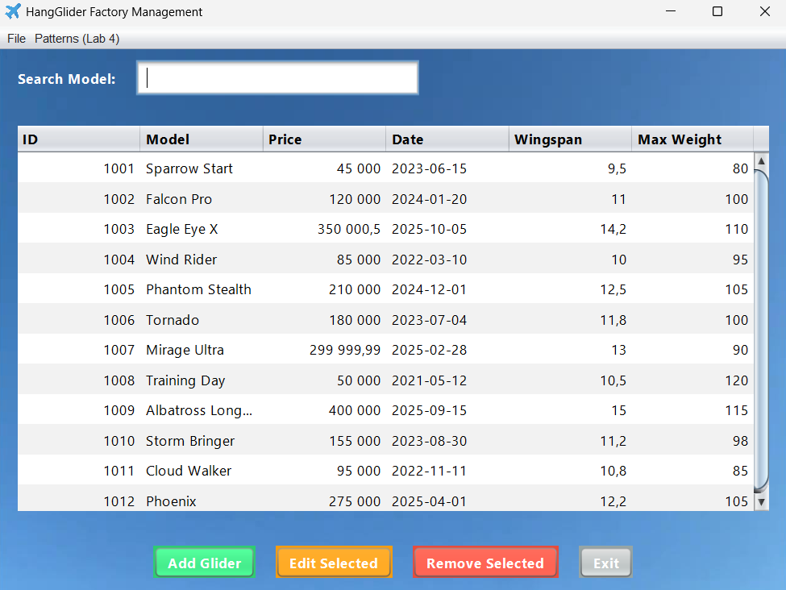

# ✈️ HangGlider Factory Management System

Комплексное Java-приложение с графическим интерфейсом (GUI) для автоматизации учета продукции на фабрике дельтапланов.
Проект включает в себя реализацию архитектурных паттернов, работу с файлами и базами данных (коллекциями).



> **Статус проекта:** Завершен (GUI, Паттерны, I/O, Тесты)

---

## ✨ Ключевые возможности

### 🖥️ Графический интерфейс (GUI)
Приложение переведено с консоли на полноценный оконный интерфейс (Swing/AWT):
*   **Табличный просмотр**: Все данные отображаются в удобной таблице с прокруткой.
*   **Интерактивность**: Кнопки для добавления, редактирования и удаления записей.
*   **Поиск**: Фильтрация списка дельтапланов по модели в реальном времени.
*   **Меню**: Быстрый доступ к функциям сохранения, загрузки и демонстрации паттернов.

### 🛠️ Управление данными (CRUD)
*   **Create**: Создание дельтапланов через диалоговые окна (включая использование паттерна **Builder**).
*   **Read**: Загрузка данных из TXT, JSON, XML.
*   **Update**: Редактирование выбранной строки в таблице.
*   **Delete**: Удаление выделенных элементов.
*   **Backup**: Архивирование данных в ZIP.

---

## 🏗️ Реализованные Паттерны (Lab 4)

Проект демонстрирует применение классических паттернов проектирования:

### 1. Builder (Строитель) + Director
Используется для гибкого создания объектов `HangGlider`.
*   Позволяет пошагово собирать сложные объекты.
*   Класс `Director` содержит готовые пресеты (например, создание стандартной модели для новичков).
*   *Доступно через меню "Patterns".*

### 2. Decorator (Декоратор)
Используется для добавления слоя безопасности при сохранении.
*   Оборачивает процесс записи файла и автоматически шифрует данные (AES Encryption), не меняя код самого класса записи.
*   Позволяет сохранять защищенные файлы, которые невозможно прочитать без ключа.

---

## 🛠️ Технологический стек

*   **Язык**: Java 17+
*   **UI**: Java Swing / AWT
*   **Библиотеки**: Gson (JSON), JAXB (XML)
*   **Тестирование**: JUnit 5
*   **Среда**: Visual Studio Code

---

## 🚀 Как запустить

1.  **Клонируйте репозиторий:**
    ```bash
    git clone https://github.com/romanshkurdziuk/java-lab-3.git
    ```
2.  **Откройте в VS Code.**
3.  **Запустите `App.java`.** Откроется главное окно приложения.

---
*Разработано в рамках лабораторных работ по программированию .*